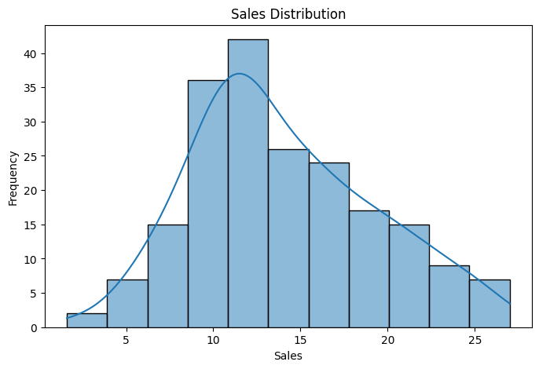
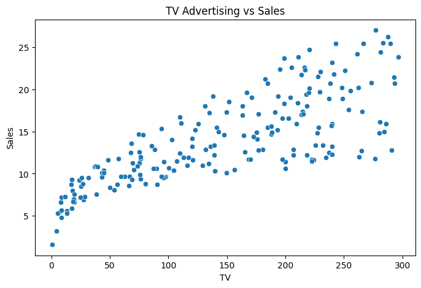
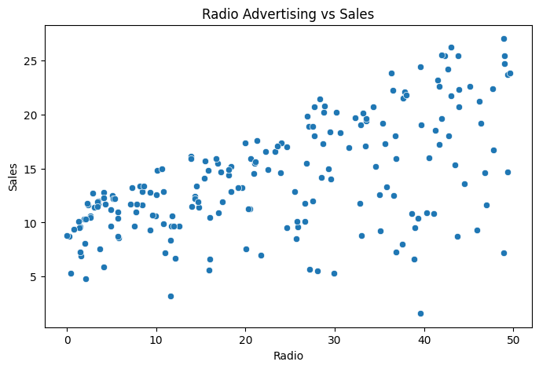
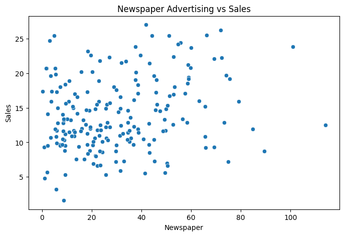
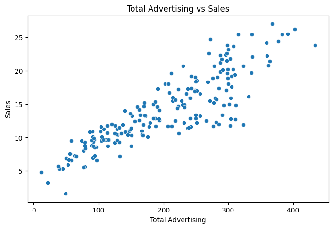
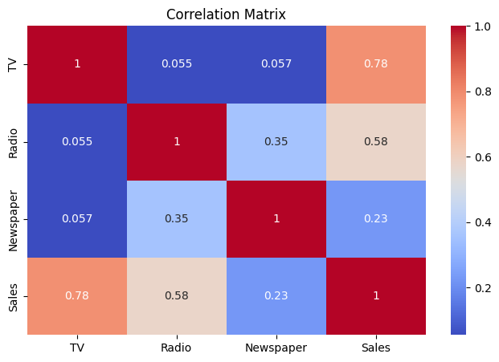
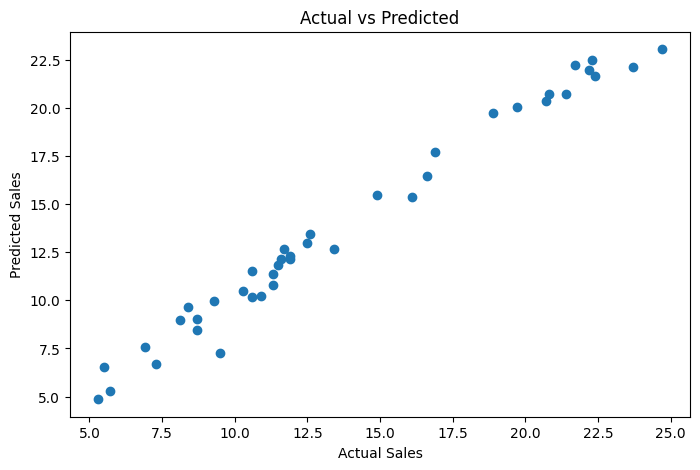
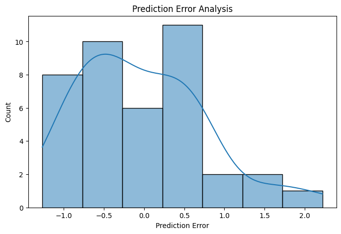
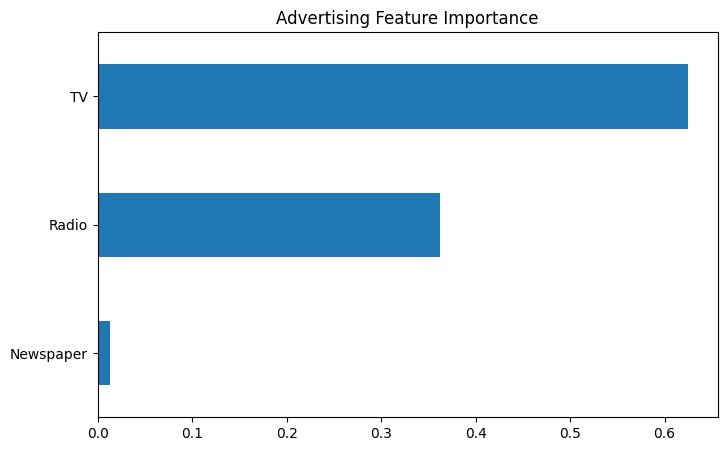

# 📊 Sales Prediction System

A Machine Learning based **Sales Prediction System** built using **Python, Pandas, NumPy, Scikit-learn, Matplotlib, Seaborn and Streamlit**.

The application predicts product sales based on advertising expenditure across **TV, Radio and Newspaper** channels. It also provides interactive data analysis, model comparison, prediction analysis and feature-importance insights.

---

## 🚀 Live Demo

👉 **Streamlit App:** [Open Live Demo](https://sales-prediction-analytics.streamlit.app/)

---

## 📌 Project Overview

The goal of this project is to analyze how advertising expenditure affects sales and build a machine learning model that can predict sales based on advertising budgets.

The project includes data preprocessing, exploratory data analysis, multiple regression models, model evaluation and an interactive Streamlit dashboard.

### Main Features

- 📊 Sales prediction
- 📺 TV advertising analysis
- 📻 Radio advertising analysis
- 📰 Newspaper advertising analysis
- 📈 Exploratory Data Analysis
- 🔗 Correlation analysis
- 🤖 Multiple regression models
- 📋 Model performance comparison
- 🎯 Actual vs Predicted analysis
- 📉 Prediction error analysis
- ⭐ Feature importance analysis
- 🌐 Interactive Streamlit dashboard

---

## 🛠️ Technologies Used

| Technology | Purpose |
|---|---|
| Python | Core programming |
| Pandas | Data handling and preprocessing |
| NumPy | Numerical operations |
| Matplotlib | Data visualization |
| Seaborn | Statistical visualization |
| Scikit-learn | Machine Learning |
| Streamlit | Interactive web application |
| Joblib | Model saving and loading |
| Git & GitHub | Version control and project hosting |

---

## 📂 Dataset

The project uses the **Advertising.csv** dataset.

The dataset contains advertising expenditure for three different channels and the corresponding sales.

### Features

- `TV` — TV advertising expenditure
- `Radio` — Radio advertising expenditure
- `Newspaper` — Newspaper advertising expenditure
- `Sales` — Target variable

The unnecessary `Unnamed: 0` index column is removed during data preprocessing.

---

## 🔄 Machine Learning Workflow

```text
Advertising Dataset
        ↓
Data Loading
        ↓
Data Cleaning
        ↓
Missing Value & Duplicate Check
        ↓
Exploratory Data Analysis
        ↓
Correlation Analysis
        ↓
Feature Selection
        ↓
Train/Test Split
        ↓
Regression Models
        ↓
Model Evaluation
        ↓
Best Model Selection
        ↓
Sales Prediction
        ↓
Streamlit Dashboard
        ↓
Deployment
```

---

## 🤖 Machine Learning Models

The project compares the following regression models:

### 1. Linear Regression

A basic regression algorithm used to understand the linear relationship between advertising expenditure and sales.

### 2. Decision Tree Regressor

A tree-based model that learns decision rules from the training data to predict sales.

### 3. Random Forest Regressor

An ensemble learning algorithm that combines multiple decision trees to improve prediction performance and reduce overfitting.

---

## 📏 Model Evaluation Metrics

The models are evaluated using:

- **MAE — Mean Absolute Error**
- **RMSE — Root Mean Squared Error**
- **R² Score — Coefficient of Determination**

### Metric Explanation

| Metric | Meaning |
|---|---|
| MAE | Average absolute difference between actual and predicted values |
| RMSE | Measures prediction error while giving more weight to larger errors |
| R² Score | Shows how well the model explains the variation in sales |

The final model is selected based on the evaluation results obtained from the test dataset.

---

# 📊 Data Visualizations

The project contains several visualizations generated during the analysis.

All visualization files are stored inside the **`Images`** folder.

> **Important:** The folder name is `Images` with a capital **I**. GitHub paths are case-sensitive, so the README must use `Images/` exactly.

---

## 📈 Sales Distribution



This visualization shows the distribution of sales values in the dataset and helps understand the overall sales pattern.

---

## 📺 TV Advertising vs Sales



This graph shows the relationship between TV advertising expenditure and sales.

---

## 📻 Radio Advertising vs Sales



This graph shows the relationship between Radio advertising expenditure and sales.

---

## 📰 Newspaper Advertising vs Sales



This graph shows the relationship between Newspaper advertising expenditure and sales.

---

## 📊 Total Advertising vs Sales



This visualization compares total advertising expenditure with sales to understand the overall relationship between advertising investment and sales.

---

## 🔗 Correlation Matrix



The correlation matrix shows the relationships between the numerical variables in the dataset.

It helps identify which advertising channels have stronger relationships with sales.

---

## 🎯 Actual vs Predicted Sales



This graph compares the actual sales values with the values predicted by the selected machine learning model.

A closer relationship between actual and predicted values indicates better prediction performance.

---

## 📉 Prediction Error Analysis



This visualization helps analyze the difference between actual sales and predicted sales and provides an understanding of model prediction errors.

---

## ⭐ Feature Importance



Feature importance shows how much each advertising feature contributes to the prediction made by the selected tree-based model.

---

# 💡 Key Business Insights

The application helps answer important business questions such as:

- Which advertising channel has a stronger relationship with sales?
- How does advertising expenditure affect sales?
- Which machine learning model performs best?
- Which features contribute most to sales prediction?
- How close are the predicted sales to the actual sales?
- How large are the prediction errors?

> **Note:** Specific percentages or numerical claims should only be added when they are obtained directly from the project's actual results.

---

# 🖥️ Streamlit Application

The Streamlit application provides an interactive interface for exploring the sales prediction system.

### Application Sections

- 🏠 Home / Dashboard
- 🔮 Sales Prediction
- 📊 Data Insights
- 🤖 Model Performance
- ⭐ Feature Importance
- ℹ️ About

Users can enter advertising expenditure values and obtain a predicted sales value through the application.

---

# 📁 Project Structure

```text
CodeAlpha_SalesPrediction/
│
├── .vscode/
│
├── CodeAlpha_sales_prediction/
│   │
│   ├── Images/
│   │   ├── actual_vs_predicted.png
│   │   ├── correlation_matrix.png
│   │   ├── feature_importance.png
│   │   ├── newspaper_vs_sales.png
│   │   ├── prediction_error_analysis.png
│   │   ├── radio_vs_sales.png
│   │   ├── sales_distribution.png
│   │   ├── total_advertising_vs_sales.png
│   │   └── tv_vs_sales.png
│   │
│   ├── models/
│   │   └── sales_prediction_model.pkl
│   │
│   ├── pages/
│   │   ├── ...
│   │
│   ├── app.py
│   ├── model_utils.py
│   ├── cleaned_data.csv
│   ├── Advertising.csv
│   └── requirements.txt
│
└── README.md
```

> Update the structure above if your actual folder/file names are different.

---

# ▶️ Run Locally

## 1. Clone the Repository

```bash
git clone https://github.com/Thatipramod/codealpha_tasks.git
```

## 2. Open the Project Folder

```bash
cd codealpha_tasks
```

## 3. Install Required Libraries

```bash
pip install -r requirements.txt
```

## 4. Run the Streamlit Application

```bash
streamlit run app.py
```

The application will open in your browser.

---

# 📦 Required Libraries

The main dependencies used in this project are:

```text
pandas
numpy
matplotlib
seaborn
scikit-learn
streamlit
joblib
```

Install them using:

```bash
pip install pandas numpy matplotlib seaborn scikit-learn streamlit joblib
```

---

# 🌐 Deployment

The application is deployed using **Streamlit Community Cloud**.

### Deployment Process

```text
GitHub Repository
        ↓
Connect Repository to Streamlit Cloud
        ↓
Select app.py
        ↓
Configure Python Environment
        ↓
Deploy
        ↓
Live Streamlit Application
```

### Live Application

👉 [Sales Prediction Streamlit App](https://sales-prediction-analytics.streamlit.app/)

---

# 🔗 Project Links

### GitHub Repository

👉 [GitHub Repository](https://github.com/Thatipramod/codealpha_tasks/tree/main)

### Live Streamlit App

👉 [Streamlit Live Demo](https://sales-prediction-analytics.streamlit.app/)

### LinkedIn

👉 [LinkedIn Profile](https://www.linkedin.com/in/thati-pramod/)

👉 **LinkedIn Project Post:** Replace this with your actual LinkedIn post URL.

---

# 🎓 CodeAlpha Internship

This project was developed as part of the **CodeAlpha Data Science Internship — Task 4: Sales Prediction using Python**.

The project demonstrates:

- Data preprocessing
- Exploratory Data Analysis
- Data visualization
- Feature selection
- Regression modelling
- Model evaluation
- Sales prediction
- Interactive Streamlit application
- Machine learning model deployment

---

# 👨‍💻 Developed By

**Thati Pramod**

B.Tech — Computer Science & Engineering (AI & ML)

---

# 📜 License

This project is intended for **educational and internship purposes**.
